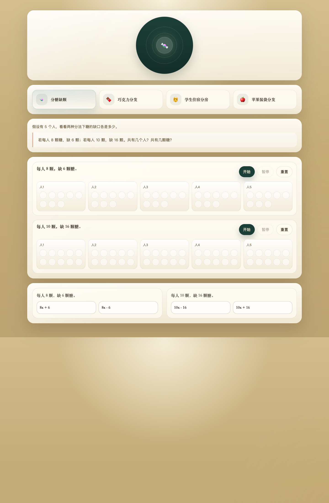
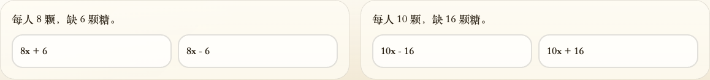
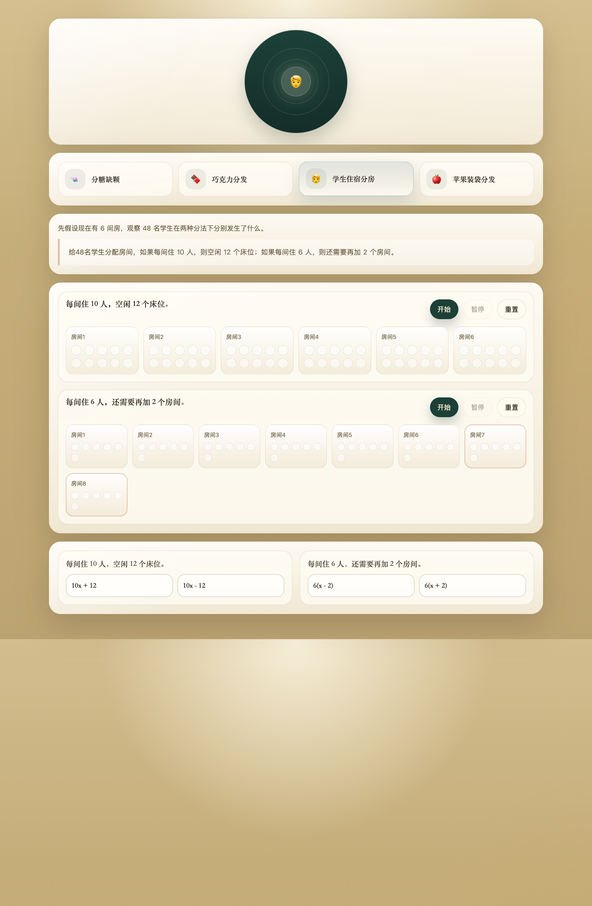
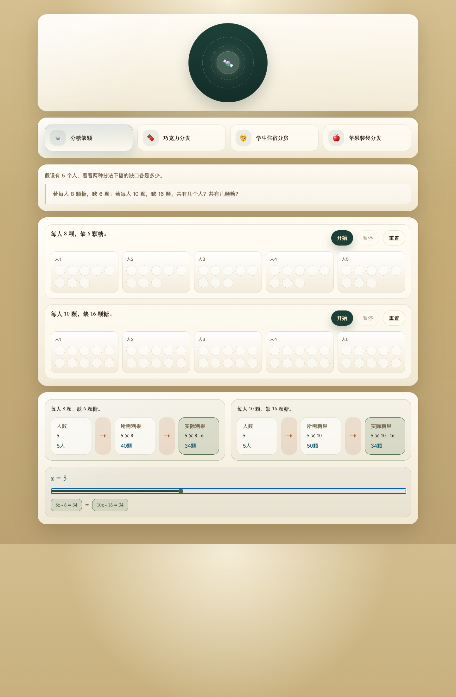

# 分配类应用题，孩子最容易掉进的两个思维误区

很多孩子做分配类应用题时，错得并不“低级”。

他不是不会乘，也不是不会列方程。  
他真正混淆的，往往是更前面的两层意思。

我们最近做 `allocation-expression-lab` 这个小实验时，越来越清楚地看到：  
孩子在这类题里最常掉进去的，不是计算坑，而是思维坑。

最典型的，就是下面两个。

*截图 1：`allocation-expression-lab` 首页。这个实验想处理的，不是“怎么算更快”，而是“题目里的关系到底被看见没有”。*

## 误区一：把“需要”和“实际”混淆

这是分配题里最常见、也最隐蔽的混淆。

孩子看到一句话：

“每袋装 8 个苹果，还剩 2 个苹果。”

他很容易马上写出一个式子，  
但这个式子到底表示什么，心里其实并不清楚。

有些孩子会写成 `8x - 2`，  
不是因为不会加减，  
而是因为他把两个层次混在了一起：

- “按每袋 8 个来分，一共能分出多少”  
- “实际上手里总共有多少苹果”

这两个量不是一个东西。

`8x` 表示的是“装满 x 袋时袋子里面的苹果数”。  
“还剩 2 个苹果”说的是：在这些已经装进袋子的苹果之外，外面还剩下 2 个。

所以真正的“实际苹果总数”应该是：

`8x + 2`

这里最关键的，不是那个 `+2`。  
而是孩子有没有意识到：

我现在写的到底是“需要多少”，还是“实际有多少”。

同样的混淆，也会出现在“缺少”这类句子里。

比如：

“每人 8 颗糖，缺 6 颗糖。”

这里的 `8x` 不是实际糖数，  
而是“如果人人都能分到 8 颗，本来需要的糖数”。

而“缺 6 颗”表示的是：

实际糖数比需要的糖数少 6。

所以实际糖数不是 `8x + 6`，而是：

`8x - 6`

*截图 2：表达式选择阶段。这里故意不让孩子一开始自由输入，而是先逼他分清：这个式子到底在表示“需要”，还是在表示“实际”。*

很多时候，孩子不是不会列式，而是没有先问这句话：

**我现在写出来的这个式子，表示的是需求量，还是实际量？**

如果这句不先问，后面的正负号就很容易漂。

## 误区二：把多个关系混淆

第二个误区，比第一个更深一点。

孩子不是只混淆“需要”和“实际”，  
他还会把题目里本来分属不同关系链的量，全部揉成一团。

最典型的就是“床”和“人”的混淆。

比如这道题：

“每间住 10 人，空闲 12 个床位；每间住 6 人，还需要再加 2 个房间。”

很多孩子一看见数字，就会想赶紧写式子。  
但其实这道题里至少有两条不同的关系：

第一条关系是：

房间数 → 床位数 → 实际人数

第二条关系是：

房间数变化 → 实际可住人数

问题在于，孩子常常会直接把“床位”和“人数”当成同一个层次。

于是就出现了典型错误：

“每间住 10 人，空闲 12 个床位”  
写成 `10x + 12`

为什么会写错？

因为他把这句话误听成了：

“有 10x 个人，再多 12 个。”

可题目真正说的不是“人数多 12”，  
而是“床位比人数多 12”。

也就是说：

- `10x` 是床位总数
- “空闲 12 个床位”说明有 12 个床位没人住
- 真正住进去的人数，应该比床位总数少 12

所以这里的关系不是：

人数 + 12

而是：

床位数 - 12 = 实际人数

*截图 3：房间场景里，孩子先看到的是房间、床位、空位，而不是直接看到 `10x - 12`。这样“床”和“人”不容易一上来就混成一个量。*

同样地，第二句：

“每间住 6 人，还需要再加 2 个房间。”

很多孩子会写成 `6x - 2`，  
因为他把“房间”这层关系和“人数”这层关系又混在了一起。

但这句话真正变化的，首先不是人数，  
而是房间数。

也就是说，关系应该先是：

房间数从 `x` 变成 `x + 2`

然后才是：

实际人数 = `6(x + 2)`

这类题一旦混淆多个关系链，孩子写出来的式子表面上有数字、有字母、有运算，  
但本质上并没有在表达清楚的对象。

## 所以，分配题不该一上来就问“怎么列式”

这也是我们做这个实验页时，一个很明确的取向：

不要一开始就把孩子推进“列式”。

因为如果前面的关系还没分开，  
列式只会变成一种仓促的翻译。

我们更希望孩子先看到：

- 什么量是在“需要”这一层
- 什么量是在“实际”这一层
- 什么量属于“床位”
- 什么量属于“人数”
- 什么量属于“袋子”
- 什么量属于“苹果”

等这些关系先站稳，式子才会跟着稳下来。

*截图 4：当关系理顺之后，两个表达式会在同一个 `x` 上相遇。等式不再像老师宣布的命令，而像同一个对象被两种方式说出来后自然重合。*

## 如果想帮孩子少走弯路，可以先问这四句话

下次再做分配类题目时，不妨先别急着问：

“式子怎么写？”

可以先问这四句：

1. 这个式子表示的是“需要”，还是“实际”？
2. 这里变化的是总量，还是组数？
3. 这句话里说的是同一种东西吗，比如都是“人数”，还是有“床位”和“人数”两层？
4. 这个数字是直接加减在总量上，还是要先改组数再去乘？

很多时候，孩子一旦把这四句想清楚，  
式子并不会更难写，反而会明显更稳。

## 最后说一句

分配类应用题最怕的，不是数字大，  
而是关系糊。

一旦“需要”和“实际”糊在一起，  
正负号就会乱。

一旦“床”和“人”、“袋”和“苹果”糊在一起，  
乘法关系就会乱。

所以真正该补的，往往不是计算速度，  
而是先把关系分开。

这也是 `allocation-expression-lab` 最想做的事：

不是替孩子更快写出答案，  
而是帮他把题目里的数量关系，一层一层看清楚。
